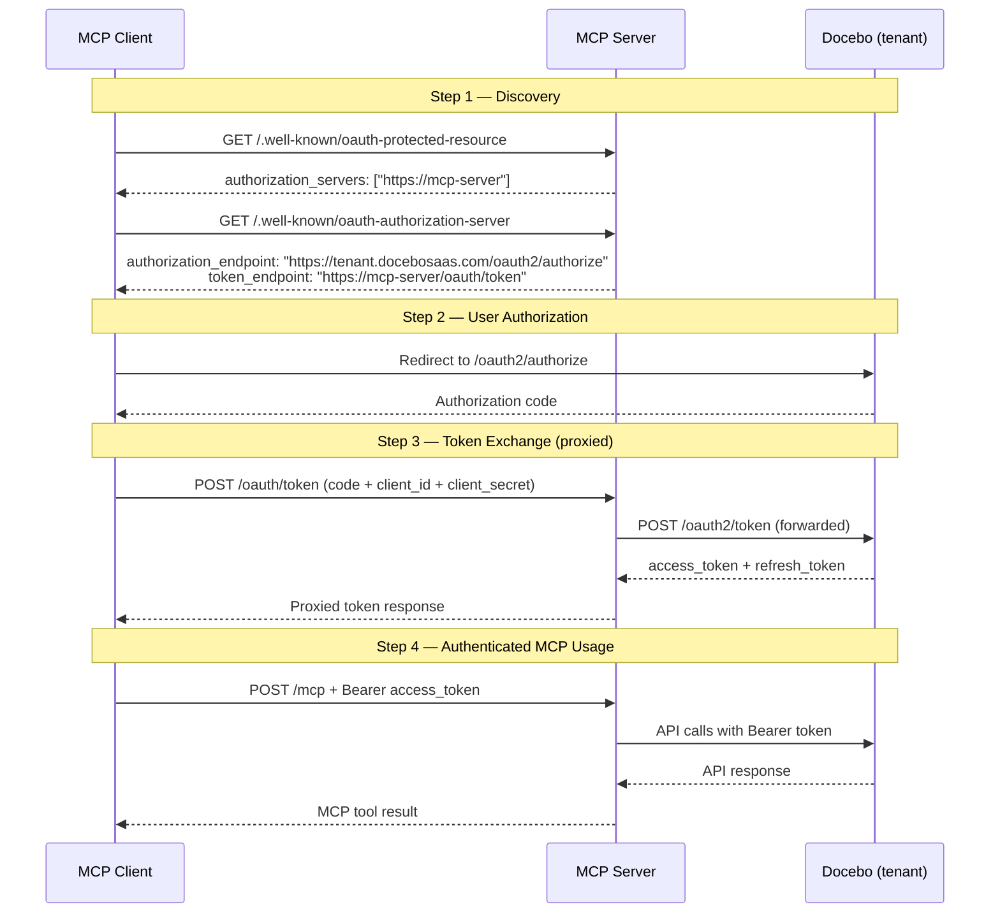
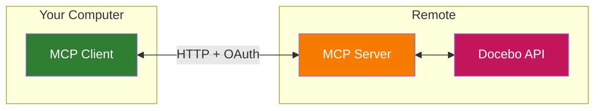

# Docebo MCP Server

An [MCP](https://modelcontextprotocol.io/) (Model Context Protocol) server that bridges Claude and other MCP clients to the [Docebo Learning Platform API](https://www.docebo.com/).

**What is MCP?**

[MCP](https://modelcontextprotocol.io/) is an open standard that lets AI models interact with external tools and data through a consistent interface. This server gives any MCP-compatible client (Claude Desktop, Claude Code, Cursor, and [others](https://modelcontextprotocol.io/clients)) the ability to read and manage your Docebo learning platform.

## Prerequisites

- Node.js >= 18
- A Docebo platform instance with API credentials (see below)
- A publicly accessible URL for the server (e.g. via a cloud provider or tunnel)

### Docebo OAuth App Setup

Each MCP client requires an **API Credentials** app registered in your Docebo admin panel (**Admin Menu > API and SSO > API Credentials**). For each app:

1. **Grant types:** Enable **Authorization Code + Implicit Grant** and **Resource Owner Password Credentials**
2. **Redirect URI:** Set to the exact callback URL for your MCP client:

| Client | Redirect URI |
|--------|-------------|
| Claude Desktop | `https://claude.ai/api/mcp/auth_callback` |
| Claude Desktop (future) | `https://claude.com/api/mcp/auth_callback` |

> **Note:** Docebo enforces strict redirect URI matching. The URI must match exactly what the MCP client sends during the OAuth flow. ChatGPT only supports Dynamic Client Registration (DCR) and Docebo does not at this time.

## Setup

### 1. Deploy the server

```bash
git clone https://github.com/riccardo-larosa/docebo-mcp-server.git
cd docebo-mcp-server
npm install && npm run build
```

Configure environment variables (see below) and start:

```bash
npm start
```

### 2. Connect Claude Desktop

Add a remote MCP server in Claude Desktop settings:

- **URL:** `https://your-server-url.example.com/mcp`

Claude Desktop will handle OAuth authorization automatically via the server's discovery endpoints.

### 3. Connect Claude Code

```bash
claude mcp add docebo --transport http https://your-server-url.example.com/mcp
```

## Example Usage

Once set up, try these example prompts:

### My Dashboard

- Show me my learner dashboard.
- What courses have I completed and what's still in progress?

### Team Training Reports

- Give me a training report for the whole team.
- Show completion status for the "Compliance" training across all users.
- Which team members haven't completed their required courses?

### Enroll by Name

- Enroll Jane Doe in the Compliance 101 course.
- Sign up John Smith for Leadership Training.

### Search and Browse

- Search for anything related to "data privacy".
- Find all courses related to "leadership".
- What training do we have about compliance?

### Send Notifications

- Send a training reminder email to Jane Smith.
- Notify John Doe about his learning plan.

## Tools

### Workflow Tools

High-level tools that combine multiple API calls into a single operation:

| Tool | Description |
|------|-------------|
| `get_my_profile` | Returns the current user's profile (no admin permissions needed) |
| `get_learner_dashboard` | Returns user profile + all course enrollments with progress in one call |
| `get_team_training_report` | Generates a team-wide training report with filters (search, course, status) |
| `enroll_user_by_name` | Enrolls a user in a course by name — no IDs needed. Returns candidates if ambiguous |
| `harmony_search` | AI-powered semantic search across Docebo content (RAG-powered) |
| `global_search` | Fast keyword search across all Docebo content types |

### Courses

| Tool | Description |
|------|-------------|
| `list_courses` | List and search courses with filters (name, category, status, sorting) |
| `get_course` | Get full details for a single course by ID |

### Enrollments

| Tool | Description |
|------|-------------|
| `list_enrollments` | List enrollments with optional user/course/status filters |
| `get_enrollment_details` | Get detailed enrollment info for a specific course + user |
| `get_user_progress` | Get all enrollments for a user (progress summary) |
| `enroll_user` | Enroll a user into a course |
| `unenroll_user` | Remove a user's enrollment from a course |

### Users

| Tool | Description |
|------|-------------|
| `list_users` | List platform users with pagination |
| `get_user` | Get details for a single user by ID |

### Notifications

| Tool | Description |
|------|-------------|
| `send_training_reminder` | Send a custom email to a user |
| `send_learning_plan_notification` | Trigger a learning plan notification for a user |

## Environment Variables

### Single-tenant mode (development)

| Variable | Required | Description |
|----------|----------|-------------|
| `API_BASE_URL` | Yes | Your Docebo instance URL (e.g., `https://your-instance.docebosaas.com`) |
| `MCP_SERVER_URL` | Yes | Public URL of this server (e.g. ngrok URL) |
| `PORT` | No | Server port (default: 3000) |

### Multi-tenant mode (production)

| Variable | Required | Description |
|----------|----------|-------------|
| `API_BASE_URL` | **Unset** | Tenant derived from `Host` subdomain instead |
| `MCP_SERVER_URL` | Yes | Public URL (e.g. `https://mcp.yourdomain.com`) |
| `PORT` | No | Server port (default: 3000) |

Multi-tenant activates when `API_BASE_URL` is not set. Requests to `acme.mcp.yourdomain.com` route API calls to `https://acme.docebosaas.com`.

> **Note:** OAuth credentials (client ID/secret) are provided by each MCP client during the OAuth flow. The server's token proxy forwards client-provided credentials to Docebo — no server-side credential storage needed.

## Development

```bash
npm run dev:hono
```

The server listens on port 3000 by default and exposes the MCP endpoint at `/mcp`.

#### HTTP API

| Endpoint | Method | Description |
|----------|--------|-------------|
| `/mcp` | POST | All MCP client requests (initialize, tool calls, prompts). Sessions tracked via `mcp-session-id` header. |
| `/health` | GET | Health check. Returns `{ status, server, version }`. |
| `/info` | GET | Service info. Returns all endpoint URLs and OAuth configuration for the current tenant. |
| `/.well-known/oauth-protected-resource` | GET | [RFC 9728](https://www.rfc-editor.org/rfc/rfc9728) Protected Resource Metadata. Returns `resource`, `authorization_servers`, `scopes_supported`, and `bearer_methods_supported`. |
| `/.well-known/oauth-authorization-server` | GET | [RFC 8414](https://www.rfc-editor.org/rfc/rfc8414) Authorization Server Metadata. Returns `issuer`, `authorization_endpoint`, `token_endpoint`, `grant_types_supported`, and `code_challenge_methods_supported`. |
| `/oauth/token` | POST | Token proxy. Forwards the client's `grant_type`, `client_id`, `client_secret`, and `code` to the tenant's `/oauth2/token` endpoint and returns the response (access token + refresh token). |

#### OAuth Discovery & Authentication Flow

The MCP server acts as both a **Protected Resource** (RFC 9728) and an **Authorization Server metadata host** (RFC 8414), proxying the actual OAuth exchange to Docebo. Here's how the two `.well-known` endpoints work together:



**Why `authorization_servers` points to the MCP server, not Docebo:** The `authorization_servers` field in the Protected Resource Metadata tells clients where to fetch the Authorization Server Metadata — not the actual authorization endpoint. Since the MCP server hosts the `/.well-known/oauth-authorization-server` endpoint (which contains the real Docebo URLs) and proxies token exchange through `/oauth/token`, it correctly advertises itself as the AS metadata host. The actual Docebo `authorization_endpoint` is revealed in step 2.

### Testing

```bash
npm test                                # All tests
npm run coverage                        # Tests with coverage
npm run test:contract                   # API contract tests (requires credentials)
```

### Debugging

Use the [MCP Inspector](https://github.com/modelcontextprotocol/inspector):

```bash
npx @modelcontextprotocol/inspector
```

### Architecture



The server has two types of tools:

- **Declarative tools** — Data structures (HTTP method, path template, parameter bindings, JSON Schema). The generic execution engine in `core.ts` handles validation, URL construction, auth, and HTTP calls.
- **Workflow tools** — Class-based tools that combine multiple API calls into a single operation. Each extends `BaseTool` and uses `DoceboApiClient` for internal HTTP calls.
