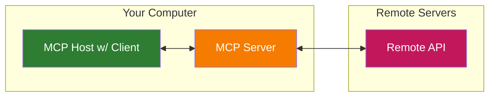
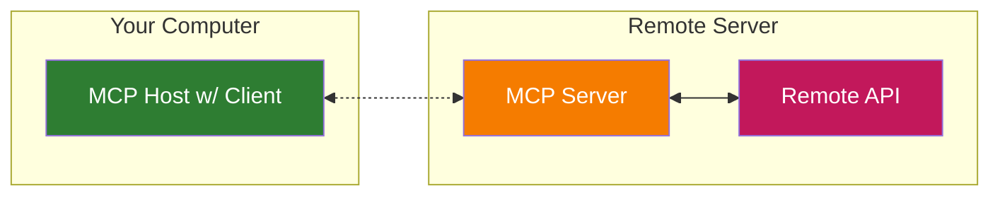

# MCP Streamable HTTP Server Example

This directory contains an example implementation of a Model Context Protocol (MCP) server using the `@modelcontextprotocol/sdk`.

It utilizes the `StreamableHTTPServerTransport` to handle MCP communication over HTTP, supporting bidirectional communication including server-sent events (SSE) for notifications.

It also includes the `simpleStreamableHttpClient.ts` to start a client and interact with the server

## Features

*   Implements the Model Context Protocol (MCP).
*   Uses `StreamableHTTPServerTransport` for HTTP-based communication.
*   Manages client sessions using the `mcp-session-id` header.
*   Handles client requests (POST), server notifications (GET via SSE), and session termination (DELETE).
*   Includes a basic example tool (`echo`).
*   Built with TypeScript and hono server.

## Prerequisites

*   Node.js (version recommended by the project, e.g., >= 18)
*   npm or yarn

## Installation

1.  Navigate to the `docebo-mcp-server` directory:
    ```bash
    cd docebo-mcp-server
    ```
2.  Install dependencies:
    ```bash
    npm install
    ```

## Building

To compile the TypeScript code to JavaScript:

```bash
npm run build
```

This will output the compiled files to a `build` directory.


By default, the server listens on port 3000 and exposes the MCP endpoint at `/mcp`.

## API Endpoint

*   **URL**: `/mcp`
*   **Methods**:
    *   `POST`: Used by clients to send requests (including the initial `initialize` request).
    *   `GET`: Used by clients to establish an SSE connection for receiving server-to-client notifications.
    *   `DELETE`: Used by clients to terminate the current MCP session.

## Session Management

The server manages client sessions using the `mcp-session-id` HTTP header. 

1.  When a client sends an `initialize` request without a session ID, the server creates a new session and a new transport, returning the `sessionId` in the response.
2.  Subsequent requests (POST, GET, DELETE) from the client **must** include the assigned `mcp-session-id` header for the server to route the request to the correct transport instance.
3.  The `DELETE /mcp` request terminates the session associated with the provided `mcp-session-id`.

## Tools

Tools can be added in the tools directory

## Run the Server
```bash
npm run dev:hono
```

## Running the Client

Use the [MCP inspector](https://github.com/modelcontextprotocol/inspector) 
```bash
npx @modelcontextprotocol/inspector
```
or you can use a CLI

```bash
npm run start:simpleClient
```

You can use the commands shown in this client to interact with the server, like 

```bash
list-tools
```

Claude Desktop as of this writing doesn't support HttpStreamable protocol.
Add the server configuration to your Claude Desktop config file (usually located at ~/Library/Application Support/Claude/claude_desktop_config.json in macOS) and restart Claude Desktop:

```json
{
  "mcpServers": {
    "docebo": {
      "command": "npx",
      "args": ["mcp-remote", "http://127.0.0.1:3000/mcp"],
      "env": {
        "BEARER_TOKEN_BEARERAUTH": "<your_token>"
      }
    }
  }
}
```

Remote MCP Server are still being developed/enhanced by different MCP Hosts like Claude Desktop.

MCP servers can be deployed in 2 different ways:
1. Local MCP Server with Remote API



2. Local Host/Client connecting to Remote MCP Server


These have created confusion about 