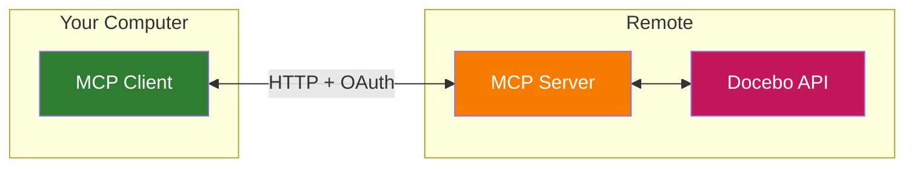

# Docebo MCP Server

An [MCP](https://modelcontextprotocol.io/) (Model Context Protocol) server that bridges Claude and other MCP clients to the [Docebo Learning Platform API](https://www.docebo.com/).

**What is MCP?**

[MCP](https://modelcontextprotocol.io/) is an open standard that lets AI models interact with external tools and data through a consistent interface. This server gives any MCP-compatible client (Claude Desktop, Claude Code, Cursor, and [others](https://modelcontextprotocol.io/clients)) the ability to read and manage your Docebo learning platform.

## Prerequisites

- Node.js >= 18
- A Docebo platform instance with API credentials (OAuth client ID/secret)
- A publicly accessible URL for the server (e.g. via a cloud provider or tunnel)

## Setup

### 1. Deploy the server

```bash
git clone https://github.com/riccardo-larosa/docebo-mcp-server.git
cd docebo-mcp-server
npm install && npm run build
```

Configure environment variables (see below) and start:

```bash
npm start
```

### 2. Connect Claude Desktop

Add a remote MCP server in Claude Desktop settings:

- **URL:** `https://your-server-url.example.com/mcp`

Claude Desktop will handle OAuth authorization automatically via the server's discovery endpoints.

### 3. Connect Claude Code

```bash
claude mcp add docebo --transport http https://your-server-url.example.com/mcp
```

## Example Usage

Once set up, try these example prompts:

### Track Learner Progress

- Show me the progress for user 12345 across all their courses.
- Which courses has Jane Smith not completed yet?
- Summarize the enrollment status for the "Onboarding" course.

### Manage Enrollments

- Enroll user 12345 in the "Compliance Training" course.
- List all enrollments for course 456.
- Remove user 67890 from the "Leadership Workshop" course.

### Search Courses

- Find all courses related to "leadership".
- Show me the details for course 456.
- List courses sorted by name.

### Send Notifications

- Send a training reminder email to user 12345.
- Trigger a learning plan notification for user 67890.

## Tools

### Courses

| Tool | Method | Description |
|------|--------|-------------|
| `list-all-courses` | GET | List and search courses with filters (name, category, status, sorting) |
| `get-a-course` | GET | Get full details for a single course by ID |

### Enrollments

| Tool | Method | Description |
|------|--------|-------------|
| `list-enrollments` | GET | List enrollments with optional user/course/status filters |
| `get-enrollment-details` | GET | Get detailed enrollment info for a specific course + user |
| `get-user-progress` | GET | Get all enrollments for a user (progress summary) |
| `enroll-user` | POST | Enroll a user into a course |
| `unenroll-user` | DELETE | Remove a user's enrollment from a course |

### Users

| Tool | Method | Description |
|------|--------|-------------|
| `list-users` | GET | List platform users with pagination |
| `get-user` | GET | Get details for a single user by ID |

### Notifications

| Tool | Method | Description |
|------|--------|-------------|
| `send-training-reminder` | POST | Send a custom email to a user |
| `send-learning-plan-notification` | POST | Trigger a learning plan notification for a user |

## Environment Variables

| Variable | Required | Description |
|----------|----------|-------------|
| `API_BASE_URL` | Yes | Your Docebo instance URL (e.g., `https://your-instance.docebosaas.com`) |
| `MCP_SERVER_URL` | Yes | Public URL of this server (enables OAuth resource server) |
| `DOCEBO_CLIENT_ID` | No | OAuth client ID (enables token proxy for public MCP clients) |
| `DOCEBO_CLIENT_SECRET` | No | OAuth client secret (enables token proxy for public MCP clients) |
| `PORT` | No | Server port (default: 3000) |

## Development

```bash
npm run dev:hono
```

The server listens on port 3000 by default and exposes the MCP endpoint at `/mcp`.

#### HTTP API

- **POST `/mcp`** — Client requests (including `initialize`)
- **GET `/mcp`** — SSE connection for server-to-client notifications
- **DELETE `/mcp`** — Terminate the MCP session
- **GET `/health`** — Health check

Sessions are tracked via the `mcp-session-id` HTTP header.

### Testing

```bash
npm test                                # All tests
npm run coverage                        # Tests with coverage
npm run test:contract                   # API contract tests (requires credentials)
```

### Debugging

Use the [MCP Inspector](https://github.com/modelcontextprotocol/inspector):

```bash
npx @modelcontextprotocol/inspector
```

### Architecture



Tool definitions are declarative data structures (not code). Each tool specifies an HTTP method, path template, parameter bindings, and JSON Schema. The execution engine in `core.ts` handles validation, URL construction, auth, and HTTP calls generically.
